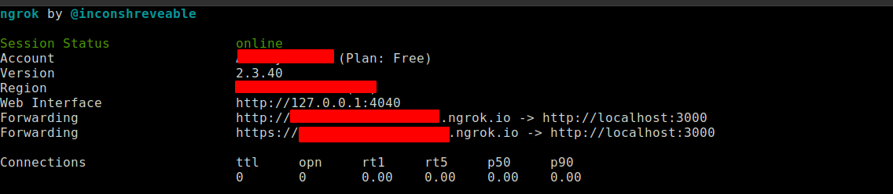
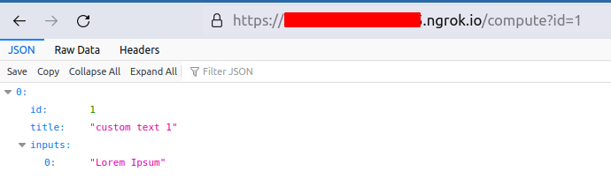

# Run compute-to-data jobs with parameters

## Content

- Pre-requistues
- Overview
- Setting up json-server
- Create docker image and push to registry
- Deploying dataset
- Deploying algorithm
- Transferring tokens
- Running compute job with parameters
- Getting results

### Pre-requistues

1. ERC20 wallet with Ocean tokens and gas for transactions
2. Running instance of compute-to-data environment
    - Operator service
    - Operator engine

### Overview

The compute-to-data environment allows users to pass parameters to the algorithm while starting compute job.
The passed parameters are added to the file url of the algo asset DDO.
e.g.
Assume that the algo DDO has files as below (rest of the ddo omitted):
```JSON
...
"files": [{
        "url": "https://example.com/compute",
        "index": 0,
        "contentType": "text/text",
      }]
...
```

Now, if paramerters `key=value` is passed to the compute job, the compute environment will query the content of the file as below:

`https://example.com/compute?key=value`

The result of the api call is stored in the path `/data/transformations/algorithm`.

Here, we will setup a `json-server` as a source of data.

### Setting up json-server

#### Installation

```bash
cd data
npm i json-server
npx json-server --watch db.json

```
Now, try this url is browser: http://localhost:3000/compute?id=1
We will pass the same content to our compute job.

#### Setup tunnel

For the purpose of demostration we will setup a public url using `ngrok` so that compute job can get the api response.

https://ngrok.com/

After ngrok is setup, start the tunnel

```bash
./ngrok http 3000
```


Now, note the url on the console, and try opening url like:

`https://<something>.ngrok.io/compute?id=1`



### Create docker image and push to registry

```bash
docker login
# Enter your docker username and password

docker build . -t <username>/c2d-algo:latest

# Dummy run
docker run --rm -it -v $PWD/data:/data --name temp <username>/c2d-algo:latest python /app/algorithm.py

docker image push akshaypatel/c2d-algo:latest
```

### Deploying dataset

### Deploying algorithm

### Running compute job with parameters